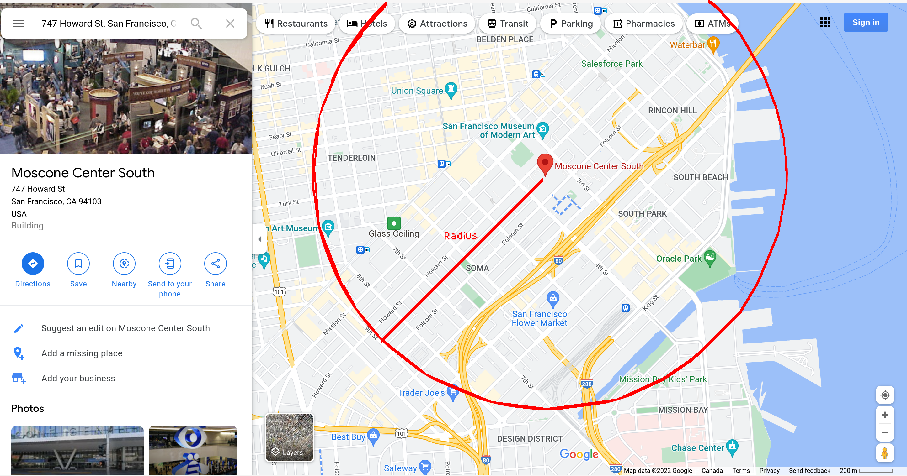

# Nebulaworks Engineering Practicum

The Engineering Practicum helps us to get a small glimpse into how you approach engineering problems.
This practicum is as follows.

### Questions

For the following questions you will be leveraging a dataset:

https://san-francisco.datasettes.com/sf-trees/Street_Tree_List

This dataset uses the open source project Datasette:

https://github.com/simonw/datasette

First, programmatically find the total number of trees in a 5 block radius of the Moscone center
(747 Howard St, San Francisco, CA 94103) from the above dataset. Feel free to leverage any language
you'd like. Along with your answer please provide a short explanation to how you came up with
your solution and reference to the source code used to find your solution (preferably in a git
repository tarball).

Second, given a scenario where the solution for question #1 must run on a periodic interval in
production, what would be your preferred approach for deploying this solution into a cloud
environment? How would you allow iterating on this in solution further without negatively
impacting production? Please explain in detail how you would approach a solution given this
scenario. Coding is not necessary for this question.

## Answers

### Part 1

The answer to the first part is the Typescript code in this repo, which you can run via:

```bash
npm install
npm run trees
```

Note that running this might take a long time, perhaps an hour or so.

In order to answer this question, the following assumptions were made:

1) Searching for "747 Howard St, San Francisco, CA 94103" in Google Maps shows the Moscone Center.

2) The question asks for "5 block radius" around that location, so this uses the rectangular "block"
   of the Moscone Center as a definition of 1 block.
   
3) Drew out a rough circle and picked a point on 9th Street that was 5 blocks away, as shown below:



4) This arbitary point has a latitude and longitude of (37.7746156090338,-122.41269931600299),
   according to Google Maps.

5) Radius is calculated by measuring the distance between that point mentioned above and the
   Moscone Center point, as per Google Maps.

6) Finally, the SF Tree dataset contains a list of trees with both latitude and longitude, so
   calculating the distance between the Moscone Center and the tree in question is done; if the
   distance between that tree is smaller than the radius, then it is within the circle.

### Part 2

The answer to the second part can be something along the lines:

1) Start by converting this code into a Cloud Function, either Google Cloud Function or AWS
   Lambda. Alternatively, this could be containerized and put onto Kubernetes, however, since
   this is just a simple Javascript program, it is okay if it is stateless; also Cloud Functions
   and Lambdas allow for straightforward scaling.

2) Deployment can be easily done through the google-cloud-sdk or aws-cli tools, and it is also
   recommended to create CI/CD scripts to allow master to be deployed to production once
   new branches are merged in, for the sake of automation.

3) Create a "staging" or "beta" function that is roughly equivalent to production; that way
   when the developers want to test this, they can deploy to the beta or staging environment.
   As long as the beta/staging environment is close enough to production, then it is probably
   is a good approximation, making it safe and convenient to experiment on.

4) Finally, a cloud cron can be created to run the function at the periodic interval needed;
   both AWS and GCP support this or have features that make this possible.

5) (Optional) If need be, can store this count value or log a list of trees, on the periodic
   basis desired, into a GCS or S3 bucket to store the output.